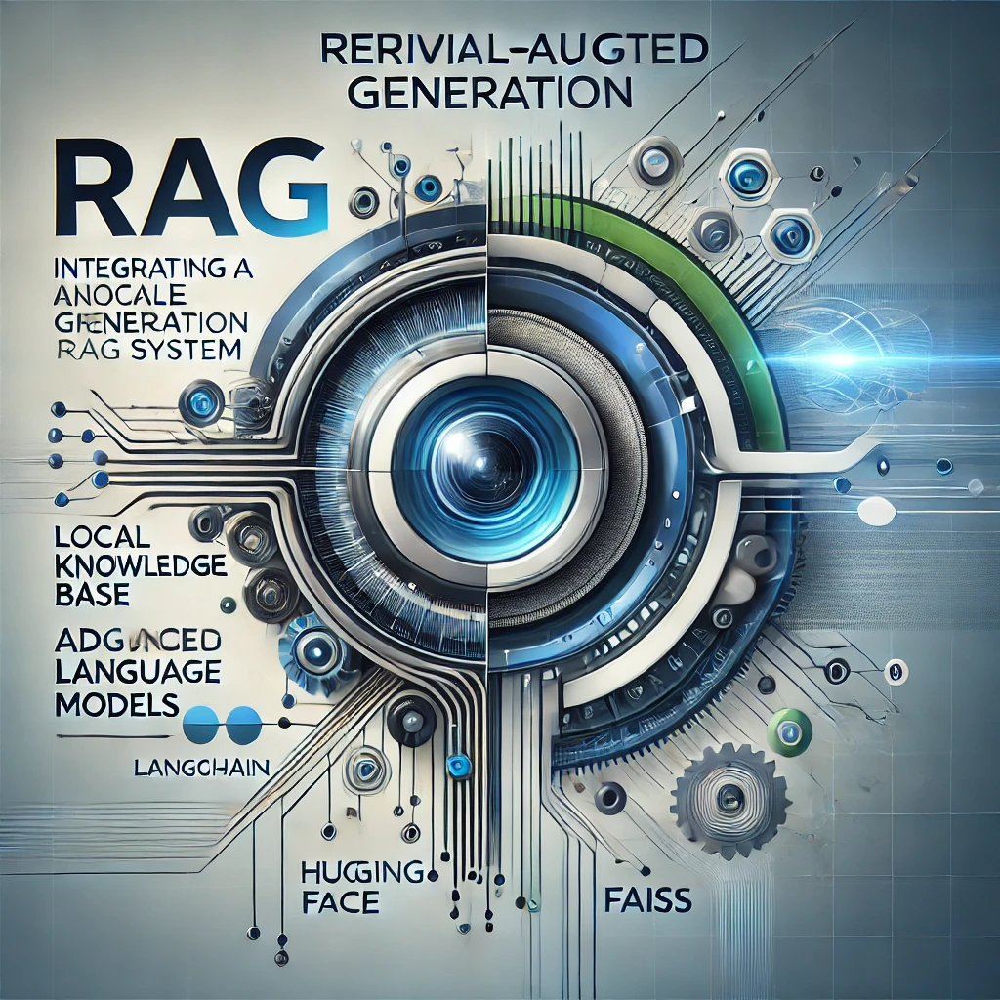

# Simple Retriver Agumented Generation (RAG) Implementation

This repository demonstrates a modular, object-oriented approach to building a **Retrieval-Augmented Generation (RAG)** system with LangChain, Hugging Face, and FAISS. So, it is complatly free application to test RAG power and see its effects on the open-source models.

</a>

## Features

- **Object-Oriented Design**: Clean, reusable components for data processing and retrieval.
- **Local Knowledge Base**: Utilize your own documents.
- **Open-Source Models**: Leverages models like `Flan-t5-base` for answer generation.

---

## Project Structure

```
simple-rag-implementation/
├── README.md
├── requirements.txt
├── data/
│   └── knowledge_base.txt
├── utils/
│   ├── __init__.py
│   ├── data_pipeline.py
│   ├── retriever_pipeline.py
├── app.py
```

---

## Requirements

- Python 3.8+
- Install dependencies:

```bash
pip install -r requirements.txt
```

---

## Usage

1. Place your knowledge base in the `knowledge_base/knowledge_base.txt` file.
2. Run the main script to process the data and start querying:

```bash
python app.py
```

Example interaction:

```plaintext
Enter your question (type 'exit' to quit): What is Cimri.com?
Answer: Cimri.com is a platform that allows users to compare product prices.
Source Documents: [<Document ...>]
```

---

## Customization

- **Embedding Model**: Update `sentence-transformers/all-MiniLM-L6-v2` in the scripts.
- **Language Model**: Change `google/flan-t5-base` to another Hugging Face model.

---

## License

This project is licensed under the GNU General Public License (v3.0).